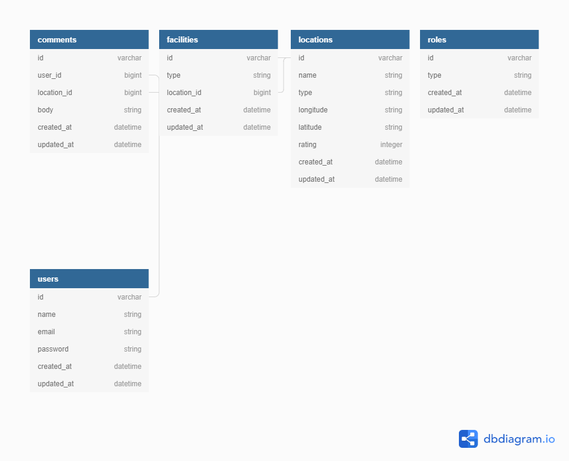
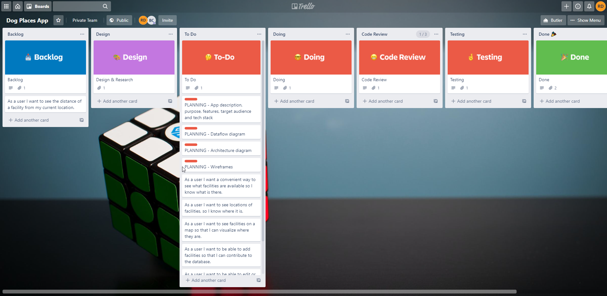

# T3A2 Dog-places app
Dog owners tool for finding parks and cafes for their four legged friends

## Purpose 
- Having a dog is an amazing thing in itself but like a lot of things it's almost always better with more dogs!
- during 2020 in melbourne wee went through a lockdown period of 9 months! and as such it's more important now than ever to socialize while being conscious of COVID-19 and as such this app hopes to bring people together and show people locations near them that accommodate them and their four legged friends.

## Features
 - Dog-places app will feature a fully fledged Rails api and a sleek React front end to allow anyone to access the site at any time on any device.
 - Dog-places app will use a geolocation service to retrieve and update locations that users have vistied or propose new location for the user to check out whilst listing facilities available at said location.

## Target audience 
- Hopefully by now you might have guessed the target audience for this app but just in case, the target is anyone with a dog! 

# Tech stack

### Front end 
- React UI/UX for the versatility of the Javascript programming language

### Back end
- Ruby on Rails API 
- postgresql database
- Knock JWT authentication

### Production services
- geolocation API
- Heroku web server for Rails integration 
- Netlify for the SPA React front end 

# Diagrams

## Data flow diagram 

## ERD

[Link to ERD](https://dbdiagram.io/d/6008bd9c80d742080a3735dd)
## Trello board

[Link to Trello](https://trello.com/b/113nxQTJ/dog-places-app)

## Application architecture diagram

# User Stories

### User
- #### Initial MVP
- As a user I want a convenient way to see what facilities are available so I know what is there.
- As a user I want to see locations of facilities, so I know where it is.
- As a user I want to see facilities on a map so that I can visualize where they are. 
- As a user I want to be able to add facilities so that I can contribute to the database
- As a user I want to be able to edit or delete places I added.
- As a user I want to be able to rate and comment on places so that there is more feedback on the facilities.

- #### Stretch Goals
- As a user I want to see the distance of a facility from my current location.
- pull data from a separate API for extra data  
## Wireframes